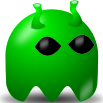
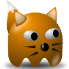
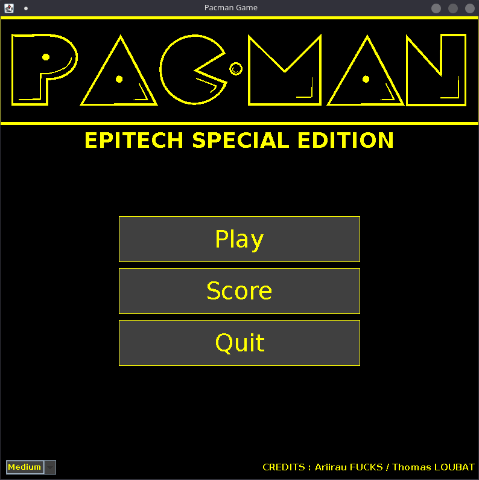
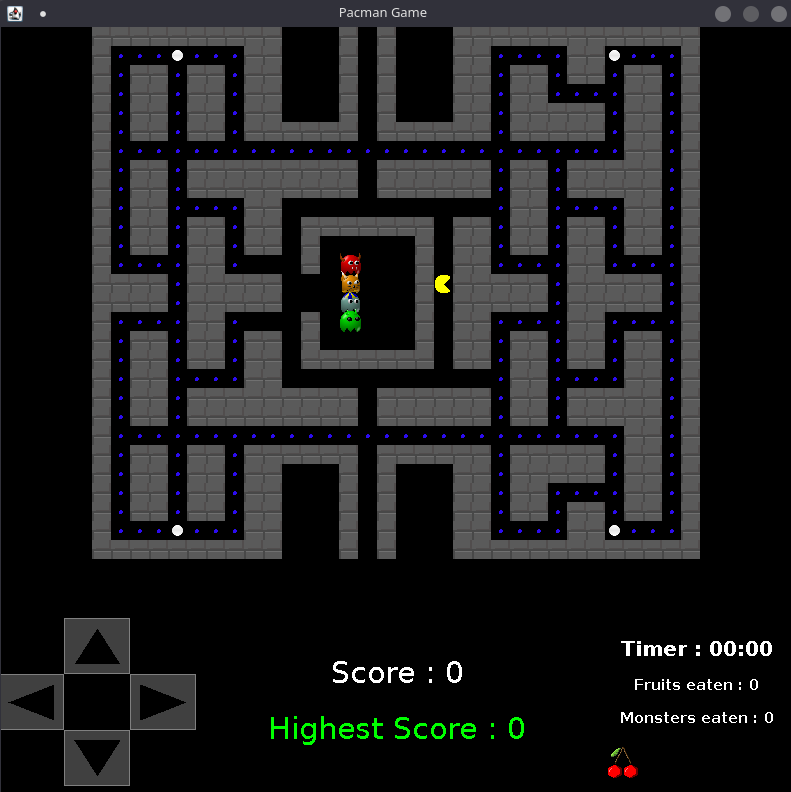

# Pac-man Game
## 2D Game (T-JAV-501-TLS_3)

## Introduction 📜
Welcome to the classic Pac-Man game version **EPITECH** ! Get ready for a nostalgic journey as 
you navigate through mazes, gobble up dots, and evade our original ghosts.
This timeless arcade experience has been recreated to bring the excitement and challenge of the original Pac-Man
to your fingertips.

## Commands 🕹️

### Installation 📥

```bash
git clone git@github.com:EpitechMscProPromo2026/T-JAV-501-TLS_3.git
cd T-JAV-501-TLS_3
```

### Run 🏃

```bash
bash ./run.sh
```

### Lint 🧹

```bash
bash ./lint.sh
```

## Team 👨‍👩‍👧‍👦

- Ariirau FUCKS
- Thomas LOUBAT

## Commit Convention

[Angular conventionnal commit](https://github.com/angular/angular/blob/68a6a07/CONTRIBUTING.md#commit)

## Overview
Pac-man the iconic yellow character who eats dots and fruits while running away from ghosts.
The goal of the game is to eat all the dots in the maze while avoiding ghosts or eat them once pac-man take a big dot.

### Presentation of ghosts 👾👻
Each ghost has a different behavior:
#### Blinky

Blinky is a ghost who only tries to touch you. In summary, he takes the shortest route to touch you. <br>

#### Pinky
Pinky sees the other ghosts as obstacles and therefore tries to ambush Pacman between him and the other ghosts.<br>

#### Inky
Same as Pinky, Inky sees the other ghosts as obstacles and therefore tries to ambush Pacman between him and the other ghosts. <br>

#### Clyde
Chase pacman until you have 10 squares between them and run away when pacman tries to close the distance. <br>


#### Algorithm
The algorithm used to find the shortest path is the [A* algorithm](https://fr.wikipedia.org/wiki/Algorithme_A*). <br>
## Features 💡⚡

| Feature                                                      | Status  |
|--------------------------------------------------------------|---------|
| Generate map from template                                   | ✅       |
| Place teleporters on map                                     | ✅       |
| Define spawn areas                                           | ✅       |
| Pacman model                                                 | ✅       |
| Dots model                                                   | ✅       |
| Big dots model                                               | ✅       |
| Fruits model                                                 | ✅       |
| Ghosts model                                                 | ✅       |
| Make ghost vulnerable when pacman eat big dot                | ✅       |
| Make fruit spawn depending on the number of points remaining | ✅       |
| When pacman eat fruit, update score                          | ✅       |
| Pacman movements                                             | ✅       |
| Ghosts basic pathfinding                                     | ✅       |
| Ghosts pathfinding considering other ghosts as obstacle      | ✅       |
| Ghosts pathfinding running away when pacman is too close     | ✅       |
| Ghosts running away from pacman when vulnerable             | ✅       |
| Ghosts return to spawn after being eaten by pacman           | ✅       |
| Set FPS to 60                                                | ✅       |
| Let the user choose difficulty                               | ✅       |
| Display map                                                  | ✅       |
| Display pacman                                               | ✅       |
| Display ghosts                                               | ✅       |
| Display dots                                                 | ✅       |
| Display big dots                                             | ✅       |
| Display fruits                                               | ✅       |
| Display score                                                | ✅       |
| Display lives                                                | ✅       |
| Display game over                                            | ✅       |
| Display victory                                              | ✅       |

## How to play 🎮

You can move pacman with the arrow keys. ⬅️ ⬆️ ⬇️ ➡️<br>
Also with the keys : Z,Q,S,D. ⌨️<br>

### Start screen 🖵


### Game screen 🖵
